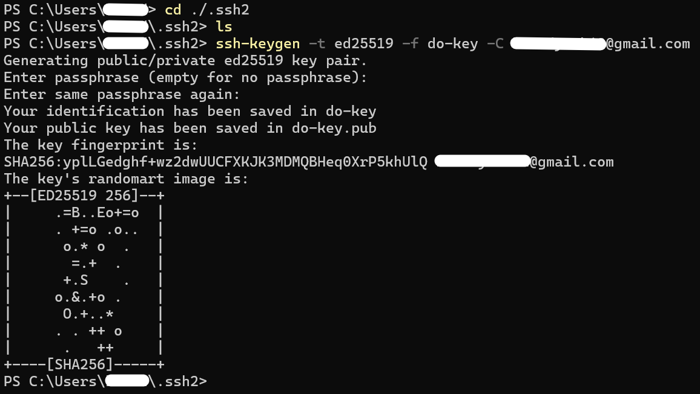
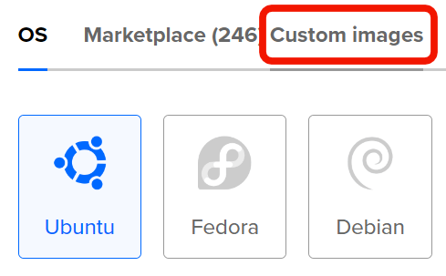
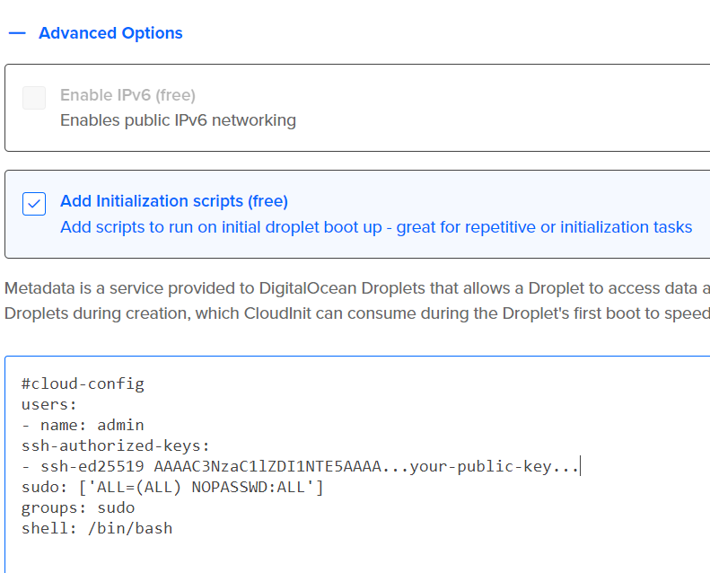

- Level 2 (Max grade 85%):
    - Create SSH keys on your local machine.
    - Add a custom Arch Linux image using the web console
    - Create a Droplet running Arch Linux using the DigitalOcean web console.
    - Use a cloud-init configuration file to automate initial setup tasks (e.g., user creation).
    - Connect to your server using your SSH keys.

Introduction

This tutorial will guide you through the process of:

Creating SSH keys on your local machine, adding a custom Arch Linux image using the DigitalOcean web console, creating a Droplet running Arch Linux using the DigitalOcean web console, and using a cloud-init configuration file to automate initial setup tasks such as user creation.

By the end of this tutorial, you will have a fully configured Arch Linux server with automated initial setup using cloud-init, and we hope that you will:

    Understand what SSH keys are and why we use them.
    Be able to create a DigitalOcean Droplet (a virtual machine) running Arch Linux.
    Have a fully configured Arch Linux server with automated initial setup using cloud-init.
    Connect securely to your server using SSH.

Let's begin!

.

Step 1: Create SSH Keys on your machine

On Windows, the easiest way to interact with your system is through PowerShell, a command-line interface. 

.

1.1: Type "powershell" in the search bar or by pressing Win+R and entering "powershell".

        Make sure your command line is in your home directory (C:\Users\"username""). 
        You can use the command 'ls' to list the contents of your current directory, and 'cd' to change directories.

.

1.2: Create the SSH Key

SSH keys are used for secure access to remote servers, without the need for passwords. Instead of logging in with a password, SSH uses a private key and a public key. The private key stays on your machine, and the public key is held on the server.

We will generate an SSH key using the ed25519 algorithm, nstead of the older RSA method. This is to ensure security of your SSH key.

In PowerShell, to create a folder for your SSH keys:
    
Type:

    mkdir .ssh
    
    cd ./.ssh

Now to generate your SSH key
    
Type: 

    ssh-keygen -t ed25519 -f do-key -C "your-email@example.com"

This command will create two files in your /.ssh directory:

    do-key (your private key, which stays on your machine)
    do-key.pub (your public key, which you will upload to DigitalOcean)

.

1.3: Setting a passphrase

You will be prompted to set a passphrase.
If you choose not to use a passphrase, simply press Enter to skip this step.

Note: It might help to write this passphrase down, as you will need it in order to use your key.

This is what your command line should look like now 
(the folder is named ssh2 in this case because I already have a .ssh folder):

.

.

Step 2: Add your SSH Key to DigitalOcean

To use this key for secure access to your Droplet, you need to add the public key to your DigitalOcean account.

.

2.1: Open your public key file with a text editor

Type:

    cat do-key.pub

Copy the output.

.

2.2: In your DigitalOcean dashboard:

- Navigate to Settings -> Security.
- Click Add SSH Key.
- Paste the public key you copied earlier and give it a recognizable name like "AwesomeKey", or something you would remember.

.

.

Step 3: Download an Arch Linux Image

DigitalOcean provides various pre-built operating system images, but you may want to use a custom Arch Linux image. This section explains how to upload a custom image.

3.1: Download the Arch Linux image from
[the official site](https://geo.mirror.pkgbuild.com/images/latest/Arch-Linux-x86_64-cloudimg.qcow2).

.

.

Step 4: Create a Droplet Running Arch Linux
Now that your custom image is uploaded, you can create a Droplet running Arch Linux.

4.1 Create a New Project

- Click **New Project** on the left side of the screen, and give it a name and description.

4.2 Create your droplet

- Click **Create** (green button), then click **Droplets** in the DigitalOcean dashboard

- Select the closest region to you.

Add a Custom Arch Linux Image:

Under Choose an Image:

    Click Custom Images
    Choose the Arch Linux image you uploaded

- Select size: *Basic* set as the default, and is recommended to use this setting.

- Choose a plan that fits your needs (e.g., the $6-7/month plan is suitable for basic usage).

- In the Authentication section, select **SSH Keys** and choose the key you added earlier.

In the *Advanced Options* section:

Click **Add Initialization Scripts (free)** and paste the following contents (from the YAML file) into it, but replace the 5th line with your public key.

    #cloud-config
    users:
    - name: admin
    ssh-authorized-keys:
    - ssh-ed25519 AAAAC3NzaC1lZDI1NTE5AAAA...your-public-key...
    sudo: ['ALL=(ALL) NOPASSWD:ALL']
    groups: sudo
    shell: /bin/bash

This cloud-init configuration:

- Creates a user named "admin" (you can use any name you'd like)

- Authorizes your SSH key for secure, passwordless login. (you need to paste your public SSH key into it)

- Grants the user full sudo privileges without needing a password for admin tasks.

- Adds the user to the sudo group for elevated access.

- Sets Bash as the default shell for the user.

Give your droplet a name, select your project, and click **Create Droplet**.

DigitalOcean will now initiate a new Droplet running Arch Linux.

.

.

Step 5: Connect to Your Droplet

Once your Droplet is ready, you will receive an IP address to connect to. 

- Use SSH to log into the server 
- Use the new username you provided in the cloud-init configuration

5.1 SSH into Your Droplet
To connect to the Droplet, paste the following command in your command line:

    ssh -i /.ssh/do-key YourUserName@YourDropletIP
    YourUserName = the username you set in the cloud-init config
    YourDropletIP = the IP of your droplet on DigitalOcean

You will now be logged into your Droplet. Don't forget your passphrase!